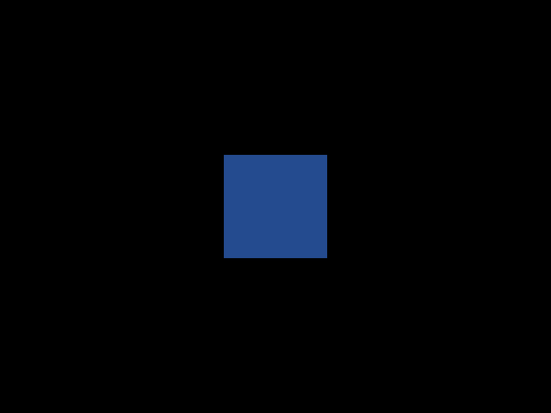

# 3D rasterizer in Rust

**Thorus Forge** is a personal learning project : a 3D software rasterizer in Rust, developed mainly on macOS. The plan is to build the math and rasterization path on the CPU first, then add optional GPU rendering with wgpu (Metal on Mac). Scenes stay small and procedural—working up shapes like a cube, sphere, and eventually a torus—with lossless WebP stills and animations as the main artifacts.

## Current progress

## Running

- `cargo run --bin still-scene` — Phong torus at terminal pixel size; displays centered in a Kitty-compatible terminal (any key to dismiss) and writes `still-scene.webp` in parallel.
- `cargo run` (default `animated-scene`) — lossless animated WebP at 800×600 (`scene.webp` by default).

## Project plans

- [`doc/planning/project-spec.md`](doc/planning/project-spec.md) — goals, math, dependencies, coordinate conventions, raster strategy
- [`doc/planning/project-breakdown.md`](doc/planning/project-breakdown.md) — iterative milestones and expected artifacts

## Project diary

Progress and write-ups live on the [project diary](https://www.tindandelion.com/rust-3d-rasterizer/).
