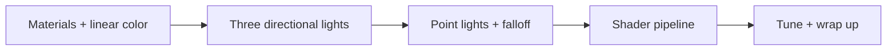

Phase 2 of our project is coming to a close, as well as the project itself. Wlthough initially we were planning to continue to the phase 3 with performance optimizations and GPU rendering, we've got bored with looking at the torus and decided to start a spin-off project with something more interesting. In this post, we're going to look back at what we've achieved since the end of [phase 1][phase-1-recap-post]. 

[Version 0.1.9 on GitHub][version-0-1-9]{: .no-github-icon}

## What you will see today

As you remember, our goal for Phase 2 was inspired by the [three.js Geometry Browser][link], and it looks like by and large we've achieved that goal. Our current scene is a still tumbling torus under a fixed orthographic camera, but the look has changed quite a bit since the [Phase 1 capstone][post-from-pixel-to-torus]. 

<video src="https://github.com/tindandelion/rust-3d-rasterizer/releases/download/0.1.9/scene.webm" alt="Phase 2 capstone — torus under mixed lights" autoplay loop muted playsinline
  width="800" style="max-width: 100%; padding-bottom: 1em; padding-top: 1em"></video>

Now we have more flexible material settings and multiple light sources of two distinct types: directional and point lights. 

## How we got here

Phase 2, in the [project plan][project-breakdown-phase-2], was meant to deepen what Phase 1 already introduced: more flexible materials and light settings. The [inspiration][post-planning-phase-2] was the [three.js Geometry Browser][geometry-browser] torus, although we didn't intend on creating a pixel-perfect clone.

As usual, we've moved forward in rather small increments. Each release added one idea, proved it in a visible artifact, and only then moved on.

Here is the progression at a glance:

Each release has a separate post in the project diary; now we'll summarise the journey grouped by theme. 

### Materials, colors, and the stage

[Materials, Colors, and the Scene][post-materials-colors-stage] rebuilt [`Material`][source-material] to match the spirit of three.js [`MeshPhongMaterial`][mesh-phong-material]: separate _emissive_, _diffuse_, and _specular_ colors, plus tunable shininess. 

Along the way we discovered that we've been working with lighting in a wrong color space. [_sRGB_][srgb] is an encoding, not a linear intensity space — so we introduced a [`Color`][source-lighting-color] type to do the shading math. That fix mattered immediately for single-light scenes, and it became essential once lights started adding up.

### Many lights, then a different kind of light

[Three Lights Are Better Than One][post-three-lights] taught the renderer how to use multiple lights setups. Three directional sources, adapted from the Geometry Browser into our left-handed coordinates, softened the shading and sculpted more of the torus surface.

[Introducing Point Lights][post-point-lights] went further:  we've introduced another type of a light source. That forced a deeper change in the rasterizer — interpolate world-space position alongside the normal, bundled as a [`SurfacePoint`][source-surface-point] — and combined both light types into a unified [`Light`][source-light] struct.

### Shaders without a GPU

By the time we've finished with the point lights, we've noticed that we've been re-implementing the same concept of value interpolation in triangles three times: interpolate vertex colors (Gouraud), interpolate normals (Phong), then interpolate normals _and_ world positions. [Shaders: Generalize Render Pipeline][post-shaders] split that pattern into a fixed rasterizer plus a [`Shader`][source-shader] trait — vertex shading produces interpolatable data; pixel shading turns the interpolated value into a color. 

Basically, we've arrived at the concept of shaders: the way modern GPU-backed render pipelines work. Although the implementation was quite rudimentary, it was a breakthrough moment that helped us understand better the design principles of rendering pipelines.

The satisfying proof of the concept was putting [_Gouraud_][gouraud] and [_Phong_][phong] back side by side as plug-in shaders on the same pipeline. For demos, we still prefer Phong; Gouraud remains as a teaching twin and a check that the abstraction is real.

## What the rasterizer can do now

In a nutshell, Phase 2 left us with a richer lighting stack on top of the Phase 1 foundation:

| Stage | What we built |
|-------|---------------|
| **Materials** | Explicit Phong colors — emissive, diffuse, specular, shininess |
| **Color** | Linear-space shading math with sRGB encode/decode at the boundaries |
| **Lights** | Unified `Light` for directional and point sources; multi-light summation; distance falloff on points |
| **Surface data** | Interpolated `SurfacePoint` (world position + normal) for per-fragment lighting |
| **Pipeline** | Rasterizer + `Shader` trait; Phong and Gouraud implementations side by side |
| **Scene look** | Geometry-browser palette, gray clear color, mixed directional + point default lights |
| **Output** | Still WebP / terminal preview, animated WebP, and release WebM at 800×600 |

Perspective projection stayed optional and unshipped — deliberately. Orthographic look-at, depth buffer, and procedural meshes carried forward unchanged from Phase 1.

## Closing up

With the completion of Phase 2, we've decided to wrap up the entire project. 

The topic of computer graphics is limitless, and we've only scratched the surface with this project. It was a lot of fun to implement the rendering pipeline from scratch, but at the end we got bored of looking at the same torus again and again. It surved its purpose for now: we need to come up with a fresh new idea of a next project to continue exploring the faccinating field of computer graphics. 

The new idea is yet to come. Stay tuned and keep coding! 

[post-from-pixel-to-torus]: {{site.baseurl}}/
[post-planning-phase-2]: {{site.baseurl}}/
[post-materials-colors-stage]: {{site.baseurl}}/
[post-three-lights]: {{site.baseurl}}/
[post-point-lights]: {{site.baseurl}}/
[post-shaders]: {{site.baseurl}}/
[version-0-1-8]: https://github.com/tindandelion/rust-3d-rasterizer/tree/0.1.8
[version-0-1-9]: https://github.com/tindandelion/rust-3d-rasterizer/tree/0.1.9
[project-breakdown-phase-2]: https://github.com/tindandelion/rust-3d-rasterizer/blob/main/doc/planning/project-breakdown.md#phase-2--rendering-pipeline-materials-lights-colors
[project-breakdown-future]: https://github.com/tindandelion/rust-3d-rasterizer/blob/main/doc/planning/project-breakdown.md#future-plans
[source-material]: https://github.com/tindandelion/rust-3d-rasterizer/blob/0.1.9/src/lighting.rs#L12
[source-lighting-color]: https://github.com/tindandelion/rust-3d-rasterizer/blob/0.1.9/src/lighting/color.rs#L9
[source-surface-point]: https://github.com/tindandelion/rust-3d-rasterizer/blob/0.1.9/src/geometry/surface_point.rs#L10
[source-light]: https://github.com/tindandelion/rust-3d-rasterizer/blob/0.1.9/src/lighting/light.rs#L5
[source-shader]: https://github.com/tindandelion/rust-3d-rasterizer/blob/0.1.9/src/lib.rs#L86
[geometry-browser]: https://threejs.org/docs/scenes/geometry-browser.html
[mesh-phong-material]: https://threejs.org/docs/#api/en/materials/MeshPhongMaterial
[srgb]: https://en.wikipedia.org/wiki/SRGB
[superposition]: https://en.wikipedia.org/wiki/Superposition_principle
[inverse-square]: https://en.wikipedia.org/wiki/Inverse-square_law
[gouraud]: https://en.wikipedia.org/wiki/Gouraud_shading
[phong]: https://en.wikipedia.org/wiki/Phong_shading
